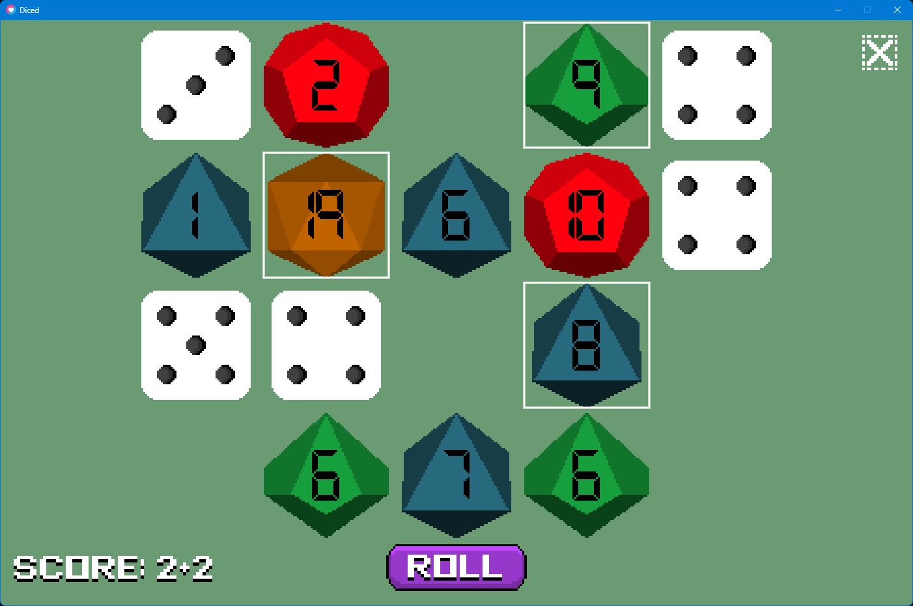

# Diced

A dice-rolling score game built with [LÖVE](https://love2d.org/) (Love2D).



## How to Play

Every round, roll your dice and decide which to sacrifice — you **must** remove at least one, but you can remove as many as you want.

**Scoring:** When you remove a die, your score increases by the difference between the die's value and its maximum. Roll a d6 and land on 6? Perfect — that's **+0**. Roll a d12 and land on 10? That's **+2**. Every pip below the max counts against you.

Your goal is to **minimize your score**. Play continues until all dice are gone — then your total is saved. Beat your personal best by keeping it as low as possible.

- Press **Escape** during a game to access the exit menu
- Your lowest score is tracked and displayed on the main menu

## Running the Game

Requires [LÖVE 11.x](https://love2d.org/).

```bash
love .
```

## Dice

The game uses five dice types: d6, d8, d10, d12, and d20.

## Project Structure

```
src/
  core/        # State machine, dice logic, save system
  ui/
    screens/   # Main menu, game loop, game over
    components # Reusable UI (buttons, stats modal)
    assets/    # Sprites and fonts
```
